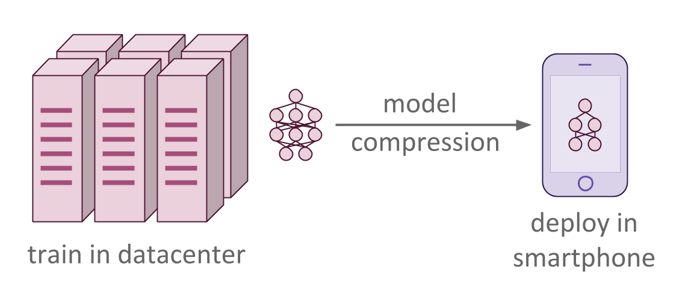
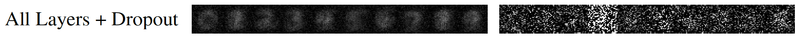
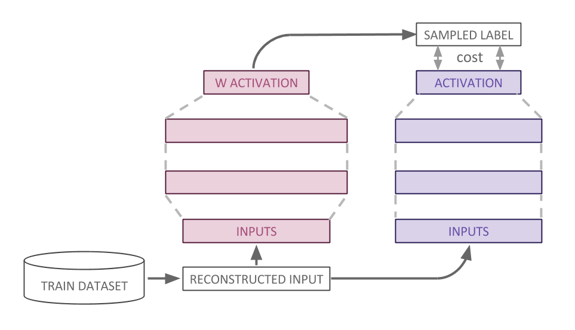
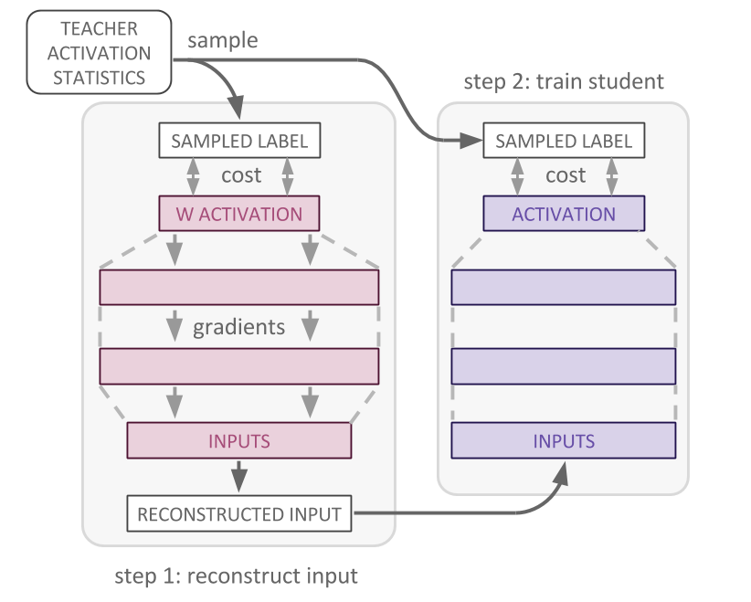
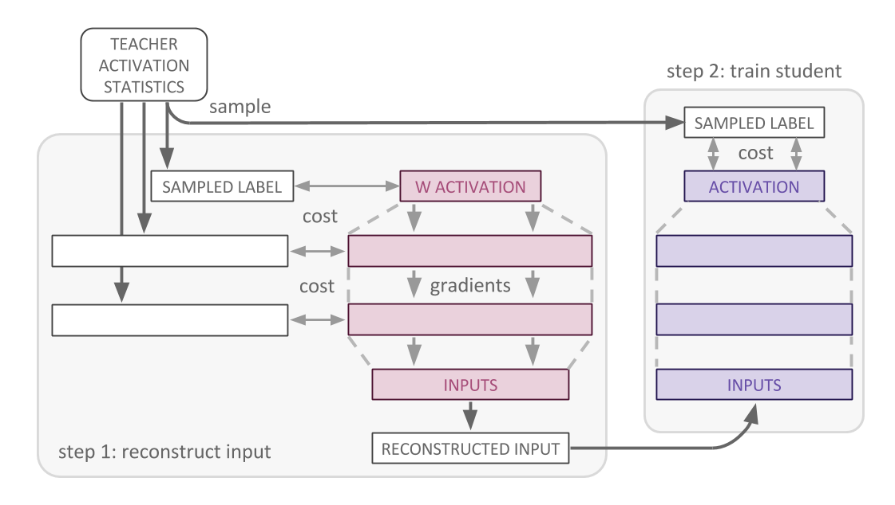
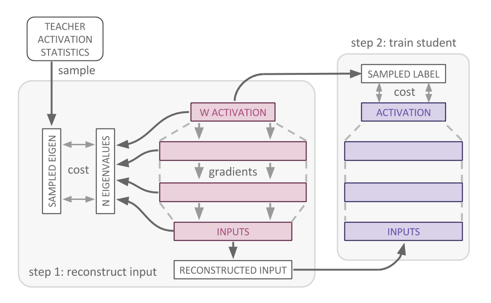

# Data-Free Knowledge Distillation For Deep Neural Networks

<div align="center">

</div>

## Abstract
Recent advances in model compression have provided procedures for compressing
large neural networks to a fraction of their original size while retaining most
if not all of their accuracy. However, all of these approaches rely on access
to the original training set, which might not always be possible if the network
to be compressed was trained on a very large non-public dataset. In this work,
we present a method for data-free knowledge distillation, which is able to
compress deep models to a fraction of their size leveraging only some extra
metadata to be provided with a pretrained model release. We also explore
different kinds of metadata that can be used with our method, and discuss
tradeoffs involved in using each of them.

### Paper
The paper is currently under review for [NIPS 2017](https://nips.cc/) and will
be on arxiv soon! In the meantime, you can feel free to read the
[poster](raphagl.com/research/NeuralNetworkKnowledgeDistillationWithNoTrainingData.pdf)
for this work, or contact me with any questions.

| [Raphael Gontijo Lopes](http://raphagl.com) | Stefano Fenu TODO(sfenu3): whore urself |
|---|---|

## Overview
Our method for knowledge distillation has a few different steps: training,
computing layer statistics on the dataset used for training, reconstructing (or
optimizing) a new dataset based solely on the trained model and the activation
statistics, and finally distilling the pre-trained "teacher" model into the
smaller "student" network. Each of these steps constitute a "procedure", which
are implemented in the `procedures/` module. Each procedure implements a `run`
function, which does everything from loading models to training.

When optimizing a dataset reconstruction, there's also the choice of different
optimization objectives (top layer, all layers, spectral all layers, spectral
layer pairs, all discussed in the paper). These are implemented in
`procedures/_optimization_objectives.py`, and take care of creating the
optimization and loss operations, as well as of sampling from the saved
activation statistics and creating a `feed_dict` that loads all necessary
placeholders.

Every dataset goes under `datasets/`, and needs to implement the same interface
as `datasets/mnist.py`. Namely, the dataset class needs to have an `io_size`
property that specifies the input size and the label output size. It also needs
two iterator methods: `train_epoch_in_batches` and `test_epoch_in_batches`.

We provide four models in `models/`: two fully connected and two convolutional.
The fully connected models are hinton-1200 and hinton-800, as described in the
original [knowledge distillation paper](https://arxiv.org/abs/1503.02531). The
convolutional models are [LeNet-5](https://arxiv.org/abs/1503.02531), and a
modified version of it which has half the number of convolutional filters per
layer. Each model implemented to be a teacher network needs to implement all
three functions in the interface: `create_model`, `load_model`, and
`load_and_freeze_model`. If a model is meant to be a student network, like
`lenet_half` and `hinton800`, then it need only implement `create_model`.

Every artifact created will be saved under `summaries/`, the default
`--summary_folder`. This includes tf summaries, checkpoints, optimized
datasets, log files with information about the experiment run, activation
statistics, etc.

## Requirements
This code requires that you have [tensorflow](https://tensorflow.org) 1.0 installed, along with `numpy`
and `scikit-image 0.13.0` on python 3.6+.

The visualization scripts (used to debug optimized/reconstructed datasets) also
require `opencv 3.2.0` and `matplotlib`.

## Usage
### Train and Save a Model
First, we need to have the model trained on the original dataset. This step can
be skipped if you already have a pre-trained model that you can easily load
through the same interface as the ones in `models/`.

The `procedure` flag specifies what to do with the model and dataset. In this
case, train it from scratch.

```bash
python main.py --run_name=experiment --model=hinton1200 --dataset=mnist \
    --procedure=train
```

### Compute and Save Statistics for that Model
We use the original dataset to compute layer statistics for the model. These
are the "metadata" mentioned in the paper, which we save so we can reconstruct
a dataset representative of the original one.

The `model_meta` and `model_checkpoint` flags are required because the
`compute_stats` procedure loads a pre-trained model.

```bash
python main.py --run_name=experiment --model=hinton1200 --dataset=mnist \
    --procedure=compute_stats \
    --model_meta=summaries/experiment/train/checkpoint/hinton1200-8000.meta \
    --model_checkpoint=summaries/experiment/train/checkpoint/hinton1200-8000
```

### Optimize a Dataset Using the Saved Model and the Statistics
This is where the real magic happens. We use the saved metadata and the
pre-trained model (but not the original dataset) to reconstruct/optimize a new
dataset that maximally reconstruct samples from the activation statistics.
These samples and the corresponding objective loss can take different forms
(`top_layer`, `all_layers`, `all_layers_dropout`, `spectral_all_layers`, `spectral_layer_pairs`),
which are discussed in the paper. Note that `all_layers_dropout` is meant for
teacher models that are trained with dropout. Currently, we only provide
`hinton1200` that does.

The pre-trained model is loaded, and a new graph is constructed using its saved
weights, but as `tf.constant`. This ensures that the only thing being
back-propagated to is the input `tf.Variable`, which is initialized to random
noise.

The `optimization_objective` flag is needed to determine what loss to use (see
paper for details, coming soon on arxiv). The `dataset` flag is only needed to
determine `io_size`, so if you're using a pre-trained model+statistics that you
don't have the original data for, you can mock the dataset class and simply
provide the `self.io_size` attribute. Using all of this, a new dataset will be
reconstructed and saved.

```bash
python main.py --run_name=experiment --model=hinton1200 --dataset=mnist \
    --procedure=optimize_dataset \
    --model_meta=summaries/experiment/train/checkpoint/hinton1200-8000.meta \
    --model_checkpoint=summaries/experiment/train/checkpoint/hinton1200-8000 \
    --optimization_objective=top_layer
    # or all_layers, spectral_all_layers, spectral_layer_pairs
```

### Distilling a Model Using One of the Reconstructed Datasets
You can then train a student network on the reconstructed dataset, and the
temperature-scaled teacher model activations. This time, the `dataset` flag is
the location where the reconstructed dataset was saved. Additionally, a
`student_model` needs to be specified to be trained from scratch. If you want
to evaluate the student's performance on the original test set (if you have
access to it), you can specify it as the `eval_dataset`.

```bash
python main.py --run_name=experiment --model=hinton1200 \
    --dataset=summaries/experiment/data/data_optimized_top_layer_experiment.npy \
    --procedure=distill \
    --model_meta=summaries/experiment/train/checkpoint/hinton1200-8000.meta \
    --model_checkpoint=summaries/experiment/train/checkpoint/hinton1200-8000 \
    --eval_dataset=mnist --student_model=hinton800 --epochs=30
```

### Distilling a Model Using Vanilla Knowledge Distillation
If you do have access to the original dataset, or you want to run Hinton's
original Knowledge Distillation [paper](https://arxiv.org/abs/1503.02531), you
can just specify that `dataset` flag.

In order to run this baseline, you only need to have a pre-trained model, and
the dataset it was originally trained with. This means you can skip the
`compute_stats` and `optimize_dataset` steps.

```bash
python main.py --run_name=experiment --model=hinton1200 --dataset=mnist \
    --procedure=distill \
    --model_meta=summaries/experiment/train/checkpoint/hinton1200-8000.meta \
    --model_checkpoint=summaries/experiment/train/checkpoint/hinton1200-8000 \
    --eval_dataset=mnist --student_model=hinton800
```

### Tips and Tricks
When using the lenet models, it should be noted that the
[original paper](http://yann.lecun.com/exdb/publis/pdf/lecun-01a.pdf)
specified that mnist was resized from 28x28 pixel images to 32x32. Thus, then
using the convolutional models we provide, make sure to use the `mnist_conv`
dataset, which automatically resize the input images. The rest of the usage
should be exactly the same.

```bash
python main.py --run_name=experiment --model=lenet --dataset=mnist_conv \
    --procedure=train

python main.py --run_name=experiment --model=lenet --dataset=mnist_conv \
    --procedure=compute_stats \
    --model_meta=summaries/experiment/train/checkpoint/lenet-8000.meta \
    --model_checkpoint=summaries/experiment/train/checkpoint/lenet-8000

python main.py --run_name=experiment --model=lenet --dataset=mnist_conv \
    --procedure=optimize_dataset \
    --model_meta=summaries/experiment/train/checkpoint/lenet-8000.meta \
    --model_checkpoint=summaries/experiment/train/checkpoint/lenet-8000 \
    --optimization_objective=top_layer
    # or all_layers, spectral_all_layers, spectral_layer_pairs

python main.py --run_name=experiment --model=lenet \
    --dataset=summaries/experiment/data/data_optimized_top_layer_experiment.npy \
    --procedure=distill \
    --model_meta=summaries/experiment/train/checkpoint/lenet-8000.meta \
    --model_checkpoint=summaries/experiment/train/checkpoint/lenet-8000 \
    --eval_dataset=mnist_conv --student_model=lenet_half --epochs=30
```

### Visualization
The `viz/` directory contains useful scripts you can run to visualize the saved
statistics and optimized datasets.

- Print top layer per class means and standard deviations
```bash
python viz/print_stats.py --run_name=experiment
```

- Vizualize per-class and per-pixel means, as well as a randomly selected
example of an optimized dataset.

```bash
python viz/print_stats.py \
    --dataset=summaries/experiment/data/data_optimized_all_layers_dropout_experiment.npy
```

<div align="center">

</div>

- Compare per-class, per-output normal distribution for both student and teacher.

Note that this requires that you have run `compute_stats` on a distilled
student model. You might also want to play with the script to make each subplot
zoomed in the best area (or apply a softmax over each mean/stddev pair of the
statistics).
```bash
python viz/stats_viz.py \
    --teacher_stats=summaries/experiment/stats/activation_stats_experiment.npy \
    --student_stats=summaries/train_distilled_student/stats/activation_stats_train_distilled_student.npy
```

- See what a sample from the top layer statistics looks like.
```bash
python viz/get_stats_sample.py --run_name=experiment
```

## License
MIT

## Appendix
For a longer description of each optimization objective, please refeer to the
paper, which will be published on arxiv soon. In the meantime, if this readme
was not sufficient, here are some diagrams from the paper:

<table>
  <tr>
    <td colspan="2" align="center" bgcolor="white">
      <br/>
      <i>Hinton's Knowledge Distillation</i>
    </td>
  </tr>
  <tr>
    <td align="center" bgcolor="white">
      <br/>
      <i>Top Layer Input Reconstruction and Distillation</i>
    </td>
    <td align="center" bgcolor="white">
      <br/>
      <i>All Layers Input Reconstruction and Distillation</i>
    </td>
  </tr>
  <tr>
    <td align="center" bgcolor="white">
      <br/>
      <i>Spectral All Layers Input Reconstruction and Distillation</i>
    </td>
    <td align="center" bgcolor="white">
      <br/>
      <i>Spectral Layer Pairs Input Reconstruction and Distillation</i>
    </td>
  </tr>
  </tr>
</table>


TODO(sfenu3): spectral optimization objectives
(search for "TODO(sfenu3"))

